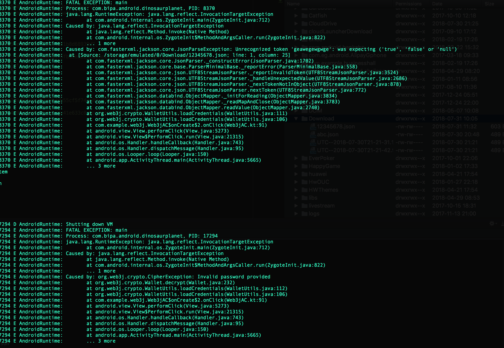

<br>
<br>
<br>
<br>
<br>
<br>
<br>
<br>
<center><font size=72>android端web3j基本使用</font></center>

<div style="page-break-after: always;"></div>


##Features
<font size=5>
轻量级的、高度模块化、灵活、安全的java库,可以处理智能合约和以太坊节点连接。

* 连接以太坊节点
* 加载以太坊钱包
* 账户之间交易
* 部署智能合约
* 调用智能合约方法
* 查看合约日志事件

</font>

<div style="page-break-after: always;"></div>


##环境配置
#####Maven
```
<dependency>
  <groupId>org.web3j</groupId>
  <artifactId>core</artifactId>
  <version>3.3.1-android</version>
</dependency>
```
#####Gradle
```
api ('org.web3j:core:3.3.1-android')
```
#####开启一个客户端本地节点
geth<br>
```
geth --rpcapi personal,db,eth,net,web3 --rpc --rinkeby
```<br>
或者[Parity](https://github.com/paritytech/parity):<br>
```
parity --chain testnet
```
<br>或者可视化的ganache
#####连接节点并发送请求
同步

```
Web3j web3 = Web3j.build(new HttpService());  // defaults to http://localhost:8545/
Web3ClientVersion web3ClientVersion = web3.web3ClientVersion().send();
String clientVersion = web3ClientVersion.getWeb3ClientVersion();
```
异步

```
Web3j web3 = Web3j.build(new HttpService());  // defaults to http://localhost:8545/
Web3ClientVersion web3ClientVersion = web3.web3ClientVersion().sendAsync().get();
String clientVersion = web3ClientVersion.getWeb3ClientVersion();
```

使用infura [官网](https://infura.io/dashboard)

#####创建和加载钱包
```
Credentials credentials = WalletUtils.loadCredentials("password", "/path/to/walletfile");
```
如果已经存在合法的keystore文件就会尝试加载钱包，文件不合法(不是json格式或者某些信息错误)会导致exception，不存在文件的话就会新建钱包
	
#####钱包转账
```
val transferReceipt = Transfer.sendFunds(web3j, credentials, "0x8717c17c23a44564a8a08510278b9b45074f8f23", BigDecimal.ONE, Convert.Unit.FINNEY).send()
Log.i("zzh", "Transaction complete, view it at https://ropsten.etherscan.io/tx/" + transferReceipt.transactionHash)
```
#####部署和加载智能合约
```
//准备
//brew tap web3j/web3j
//brew install web3j

//npm install -g solc
// solcjs --bin --abi --optimize zzhc.sol -o ./
// web3j solidity generate --javaTypes zzhc_sol_ZZHToken.bin zzhc_sol_ZZHToken.abi -o ./ -p com.organisation.name
//当前目录下生成contracts目录
//部署
YourSmartContract contract = YourSmartContract.deploy(
        <web3j>, <credentials>,
        GAS_PRICE, GAS_LIMIT,
        <param1>, ..., <paramN>).send();  // constructor params
//部署2 using a raw transaction
RawTransaction rawTransaction = RawTransaction.createContractTransaction(
        <nonce>,
        <gasPrice>,
        <gasLimit>,
        <value>,
        "0x <compiled smart contract code>");
// send...
// get contract address
EthGetTransactionReceipt transactionReceipt =
             web3j.ethGetTransactionReceipt(transactionHash).send();

if (transactionReceipt.getTransactionReceipt.isPresent()) {
    String contractAddress = transactionReceipt.get().getContractAddress();
} else {
    // try again
}
/////如果合约包含构造器的话
String encodedConstructor =
             FunctionEncoder.encodeConstructor(Arrays.asList(new Type(value), ...));

// using a regular transaction
Transaction transaction = Transaction.createContractTransaction(
        <fromAddress>,
        <nonce>,
        <gasPrice>,
        <gasLimit>,
        <value>,
        "0x <compiled smart contract code>" + encodedConstructor);

// send...

//加载
YourSmartContract contract = YourSmartContract.load(
        "0x<address>|<ensName>", <web3j>, <credentials>, GAS_PRICE, GAS_LIMIT);
//利用智能合约交易        
TransactionReceipt transactionReceipt = contract.someMethod(
             <param1>,
             ...).send();
//访问智能合约方法             
Type result = contract.someMethod(<param1>, ...).send();
```
#####过滤器
以太坊上有三类过滤类：

* Block filters
* Pending transaction filters
* Topic filters

**Note: filters are not supported on Infura.**

web3j采用函数响应式编程，可以观察链上的事件。
####Block and transaction filters

```
//个新的区块添加到区块链中
Subscription subscription = web3j.blockObservable(false).subscribe(block -> {
    ...
});
//所有添加到区块链中的交易
Subscription subscription = web3j.transactionObservable().subscribe(tx -> {
    ...
});
//一些待确认的交易记录
Subscription subscription = web3j.pendingTransactionObservable().subscribe(tx -> {
    ...
});
//取消订阅事件
subscription.unsubscribe();
```
####Replay filters
```
//To replay a range of blocks from the blockchain:
Subscription subscription = web3j.replayBlocksObservable(
        <startBlockNumber>, <endBlockNumber>, <fullTxObjects>)
        .subscribe(block -> {
            ...
});
//To replay the individual transactions contained within a range of blocks:
Subscription subscription = web3j.replayTransactionsObservable(
        <startBlockNumber>, <endBlockNumber>)
        .subscribe(tx -> {
            ...
});
//You can also get web3j to replay all blocks up to the most current, 
//and provide notification (via the submitted Observable) once you’ve caught up:
Subscription subscription = web3j.catchUpToLatestBlockObservable(
        <startBlockNumber>, <fullTxObjects>, <onCompleteObservable>)
        .subscribe(block -> {
            ...
});
//Or, if you’d rather replay all blocks to the most current, then be notified 
//of new subsequent blocks being created:
Subscription subscription = web3j.catchUpToLatestAndSubscribeToNewBlocksObservable(
        <startBlockNumber>, <fullTxObjects>)
        .subscribe(block -> {
            ...
});
//As above, but with transactions contained within blocks:
Subscription subscription = web3j.catchUpToLatestAndSubscribeToNewTransactionsObservable(
        <startBlockNumber>)
        .subscribe(tx -> {
            ...
});
```
####Topic filters and EVM events
```
EthFilter filter = new EthFilter(DefaultBlockParameterName.EARLIEST,
        DefaultBlockParameterName.LATEST, <contract-address>)
             [.addSingleTopic(...) | .addOptionalTopics(..., ...) | ...];
             
web3j.ethLogObservable(filter).subscribe(log -> {
    ...
});
```
#####交易Transactions
三类交易：

* Transfer of Ether from one party to another
* Creation of a smart contract
* Transacting with a smart contract

1. 使用钱包交易 ↑
2. 自定义交易

	```
	eb3j web3 = Web3j.build(new HttpService());  // defaults to http://localhost:8545/
Credentials credentials = WalletUtils.loadCredentials("password", "/path/to/walletfile");

	// get the next available nonce
	EthGetTransactionCount ethGetTransactionCount = web3j.ethGetTransactionCount(
             address, DefaultBlockParameterName.LATEST).send();
	BigInteger nonce = ethGetTransactionCount.getTransactionCount();

	// create our transaction
	RawTransaction rawTransaction  = RawTransaction.createEtherTransaction(
             nonce, <gas price>, <gas limit>, <toAddress>, <value>);

	// sign & send our transaction
	byte[] signedMessage = TransactionEncoder.signMessage(rawTransaction, credentials);
	String hexValue = Numeric.toHexString(signedMessage);
	EthSendTransaction ethSendTransaction = web3j.ethSendRawTransaction(hexValue).send();
	//
	```
3. 管理员身份交易

	```
	Admin web3j = Admin.build(new HttpService());  // defaults to http://localhost:8545/
	PersonalUnlockAccount personalUnlockAccount = web3j.personalUnlockAccount("0x000...", "a 	password").sendAsync().get();
	if (personalUnlockAccount.accountUnlocked()) {
   	 // send a transaction
	}
	``` 

##离线签名机制
####ETH转账签名
```
fun signedEthTransactionData(to: String, //转账的钱包地址
                                 nonce: BigInteger,//获取到的交易次数
                                 gasPrice: BigInteger, //
                                 gasLimit: BigInteger, //
                                 value: Double, //转账的值
                                 credentials: Credentials): String {
        //把十进制的转换成ETH的Wei, 1ETH = 10^18 Wei
    val realValue = Convert.toWei(value.toString(), Convert.Unit.ETHER)
    val rawTransaction = RawTransaction.createEtherTransaction(
            nonce,
            gasPrice,
            gasLimit,
            to,
            realValue.toBigIntegerExact())
    //手续费= (gasPrice * gasLimit ) / 10^18 ether
    //使用TransactionEncoder对RawTransaction进行签名操作
    val signedMessage = TransactionEncoder.signMessage(rawTransaction, credentials)
    //转换成0x开头的字符串
    return Numeric.toHexString(signedMessage)
}
```
####基于以太坊的代币转账签名
```
fun signedContractTransactionData(contractAddress: String,//代币的智能合约地址
                                      toAdress: String,//对方的地址
                                      nonce: BigInteger,//获取到交易数量
                                      gasPrice: BigInteger,
                                      gasLimit: BigInteger,
                                      value: Double, decimal: Double,
                                      credentials: Credentials): String {
    //因为每个代币可以规定自己的小数位, 所以实际的转账值=数值 * 10^小数位
    val realValue = BigDecimal.valueOf(value * Math.pow(10.0, decimal))
    //0xa9059cbb代表某个代币的转账方法hex(transfer) + 对方的转账地址hex + 转账的值的hex
    val data = methodHeader("transfer(address,uint256)")//Params.Abi.transfer + // 0xa9059cbb
            Numeric.toHexStringNoPrefixZeroPadded(Numeric.toBigInt(toAdress), 64) +
            Numeric.toHexStringNoPrefixZeroPadded(realValue.toBigInteger(), 64)
    val rawTransaction = RawTransaction.createTransaction(
            nonce,
            gasPrice,
            gasLimit,
            contractAddress,
            data)

    //使用TransactionEncoder对RawTransaction进行签名操作
    val signedMessage = TransactionEncoder.signMessage(rawTransaction, credentials)
    //转换成0x开头的字符串
    return Numeric.toHexString(signedMessage)
}
    
fun methodHeader(method: String): String {
    val bytes = method.toByteArray()
    val bytes1 = org.web3j.crypto.Hash.sha3(bytes)
    val hex = Numeric.toHexString(bytes1, 0, 4, true)
    return hex
}
```
####这里我们提供另外一种web3j既有的封装实现,不用关心内部参数是如何拼接的.(推荐)
```
@Throws(IOException::class, CipherException::class)
    fun signContractTransaction(contractAddress: String,
                                to: String,
                                nonce: BigInteger,
                                gasPrice: BigInteger,
                                gasLimit: BigInteger,
                                amount: BigDecimal,
                                decimal: BigDecimal,
                                crenditial: Credentials,
                                password: String): String {
    val realValue = amount.multiply(decimal)
    val function = Function("transfer",
            Arrays.asList<Type<out Any>>(Address(to), Uint256(realValue.toBigInteger())),
            Arrays.asList<TypeReference<*>>())
    val data = FunctionEncoder.encode(function)
    val rawTransaction = RawTransaction.createTransaction(
            nonce,
            gasPrice,
            gasLimit,
            contractAddress,
            data)
    var signedMessage = TransactionEncoder.signMessage(rawTransaction, crenditial)
    return Numeric.toHexString(signedMessage);
}
```

##Ethereum Name Service(ENS)
[https://ens.domains/](https://ens.domains/)


<div style="page-break-after: always;"></div>


[git](https://github.com/web3j/web3j/)

[doc](https://docs.web3j.io/transactions.html)