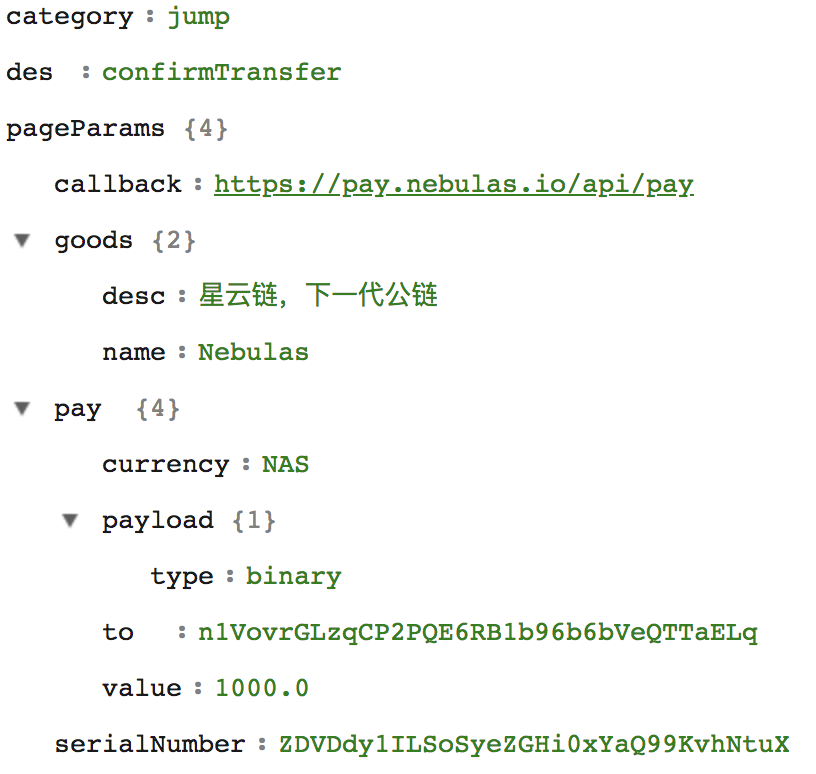
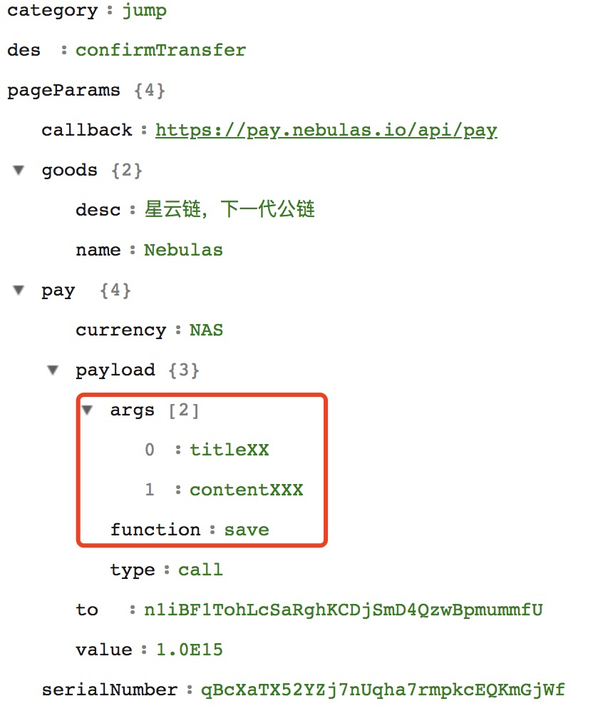
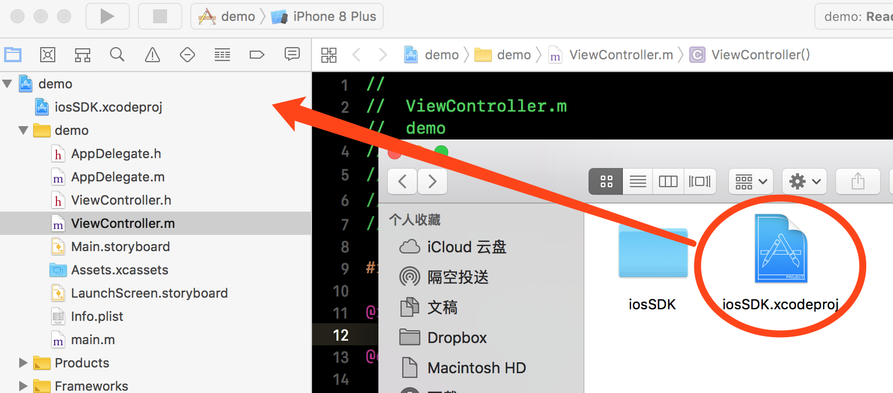
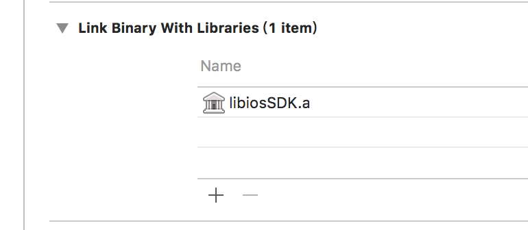
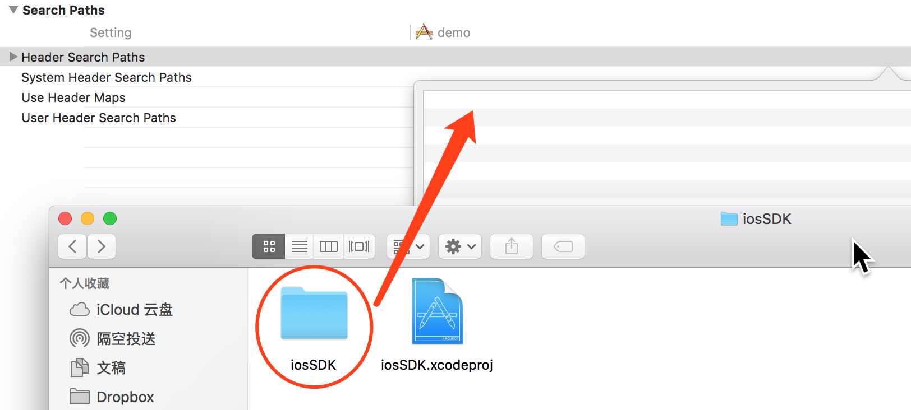
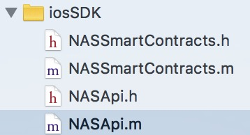

<br>
<br>
<br>
<br>
<br>
<br>
<br>
<br>
<center><font size=72>nebulas native使用</font></center>

<div style="page-break-after: always;"></div>


##安卓接入
1. 将libnebulas-release.aar包复制到项目的libs中
2. 在build.gradle中引入相关依赖描述

```
repositories {
    flatDir {
        dir 'libs'
    }
}
dependencies {
...
    compile(name: 'libnebulas-release', ext: 'aar')
    implementation 'com.squareup.okhttp3:okhttp:3.10.0'
    implementation 'com.google.code.gson:gson:2.8.4'
...
}
```
##调用API
* PAY、CALL、Query Transfer STATUS：与NebPay相关接口对应
* Query Account STATUS：与neb.api相关接口相对应
* CALL CONTRACT FUNCTION：模拟调用

####PAY
与NebPay.pay()底层调用一样，只是NebPay.pay()返回serialNumber

只能使用主网，无法通过修改sdk源码支持测试网

```
/**
     * pay接口：       星云地址之间的转账
     *
     * @param mainNet      0 测试网    1 主网
     * @param goods        商品详情
     * @param to           转账目标地址
     * @param value        转账value，单位为wei (1NAS =10^18 wei)
     * @param serialNumber 随机码
     */
public static void pay(Context context, int mainNet, GoodsModel goods, String to, String value, String serialNumber)

/*
openapp.nasnano://virtual?params={"category":"jump","des":"confirmTransfer","pageParams":{"callback":"https://pay.nebulas.io/api/pay","goods":{"desc":"星云链，下一代公链","name":"Nebulas"},"pay":{"currency":"NAS","payload":{"type":"binary"},"to":"n1VovrGLzqCP2PQE6RB1b96b6bVeQTTaELq","value":"1000.0"},"serialNumber":"ZDVDdy1ILSoSyeZGHi0xYaQ99KvhNtuX"}}
*/
```



```
<activity android:name="io.nebulas.wallet.android.module.launch.H5RaiseDeliverActivity" android:screenOrientation="portrait">
            <intent-filter>
                <action android:name="android.intent.action.VIEW"/>
                <category android:name="android.intent.category.DEFAULT"/>
                <category android:name="android.intent.category.BROWSABLE"/>
                <data android:scheme="openapp.nasnano"/>
            </intent-filter>
        </activity>
```

```
ContractAction.start(context, url);
```
```
/**
     * Schema 方式启动星云钱包
     * @param context 上下文
     * @param url     schema
     */
    public static void start(Context context, String url) {
        if (context == null || TextUtils.isEmpty(url)) {
            return;
        }
        try {
            Intent intent = new Intent(Intent.ACTION_VIEW, Uri.parse(url));
            intent.addFlags(Intent.FLAG_ACTIVITY_NEW_TASK);
            context.startActivity(intent);
        } catch (Exception e) {
            handleException(context);
        }
    }
```

####CALL
与NebPay.call()底层调用一样，只是NebPay.call()返回serialNumber

只能使用主网，无法通过修改sdk源码支持测试网

```
String to = "n1iBF1TohLcSaRghKCDjSmD4QzwBpmummfU";//部署上链的，合约地址，合约地址，合约地址
        String functionName = "save";
        String[] args = new String[]{"titleXX","contentXXX"};
        SmartContracts.call(this, Constants.TEST_NET ,  goods, functionName, to, value, args, serialNumber);
```
```
/**
     * call函数：      调用智能合约
     * 所得结果上链
     *
     * @param mainNet      0 测试网    1 主网
     * @param goods        商品详情（*）
     * @param functionName 调用合约的函数名
     * @param to           转账目标地址
     * @param value        转账value，单位为wei (1NAS =10^18 wei)
     * @param args         函数参数列表
     * @param serialNumber 随机码
     */
    public static void call(Context context, int mainNet, GoodsModel goods, String functionName, String to, String value, String[] args, String serialNumber)
    
openapp.nasnano://virtual?params={"category":"jump","des":"confirmTransfer","pageParams":{"callback":"https://pay.nebulas.io/api/pay","goods":{"desc":"星云链，下一代公链","name":"Nebulas"},"pay":{"currency":"NAS","payload":{"args":["titleXX","contentXXX"],"function":"save","type":"call"},"to":"n1iBF1TohLcSaRghKCDjSmD4QzwBpmummfU","value":"1.0E15"},"serialNumber":"qBcXaTX52YZj7nUqha7rmpkcEQKmGjWf"}}
```



之后的代码调用和pay接口一模一样

```
ContractAction.start(context, url);
```

####Query Transfer STATUS
与NebPay.queryPayInfo()底层调用一样，只是NebPay.pay()返回serialNumber

只能使用主网，可以通过修改sdk源码支持测试网

```
SmartContracts.queryTransferStatus(Constants.TEST_NET, serialNumber,new SmartContracts.StatusCallback(){
            @Override
            public void onSuccess(String response) {
                Log.i(TAG,"response:" + response);
                Looper.prepare();
                Toast.makeText(MainActivity.this,"response:"+response,Toast.LENGTH_LONG).show();
                Looper.loop();
            }

            @Override
            public void onFail(String error) {
                Log.i(TAG,"error:" + error);
                Looper.prepare();
                Toast.makeText(MainActivity.this,"error:" + error,Toast.LENGTH_LONG).show();
                Looper.loop();
            }
        });
```
```
/**
     * 查询交易状态
     *
     * @param mainNet      0 测试网    1 主网
     * @param serialNumber
     */
    public static void queryTransferStatus(int mainNet, String serialNumber, final StatusCallback callback) {

        String ENDPOINT = "";

        if (mainNet == 0) {
            ENDPOINT = Constants.MAIN_NET_PAY_URL + "pay/query?payId=" + serialNumber;
        } else {
            ENDPOINT = Constants.MAIN_NET_PAY_URL + "mainnet/pay/query?payId=" + serialNumber;
        }

        Request request = new Request.Builder().get().url(ENDPOINT).build();
        OkHttpManager.getInstance().getOkHttpClient().newCall(request).enqueue(new Callback() {
            @Override
            public void onFailure(Call call, IOException e) {
                if (callback != null) {
                    callback.onFail(e.getMessage());
                }
            }

            @Override
            public void onResponse(Call call, Response response) throws IOException {
                if (callback != null && response != null) {
                    callback.onSuccess(response.body().string());
                }
            }
        });
    }
```
####Query Account STATUS
与neb.api.getAccountState(address)底层调用一样

只能使用主网，可以通过修改sdk源码支持测试网

```
/**
     * 查询地址详细信息
     * @param address
     * @param callback
     */
    public static void queryAccountState(String address, final StatusCallback callback) {
        AccountState accountState = new AccountState();
        accountState.address = address;
        RequestBody requestBody = FormBody.create(MediaType.parse("application/json; charset=utf-8")
                , new Gson().toJson(accountState));
        Request request = new Request.Builder().url(Constants.MAIN_NET_RPC_ACCOUNT_STATE_URL).post(requestBody).build();
        OkHttpManager.getInstance().getOkHttpClient().newCall(request).enqueue(new Callback() {
            @Override
            public void onFailure(Call call, IOException e) {
                if (callback != null) {
                    if (callback != null) {
                        callback.onFail(e.getMessage());
                    }
                }
            }

            @Override
            public void onResponse(Call call, Response response) throws IOException {
                if (callback != null && response != null) {
                    callback.onSuccess(response.body().string());
                }

            }
        });
    }
```
####CALL CONTRACT FUNCTION
调用合约方法：https://mainnet.nebulas.io/v1/user/call，和neb.api.call()、NebPay.simulateCall(以后会被弃用)效果一样是模拟执行，执行的结果并不会上链，常用于调用get类型的接口，查询数据。

只能使用主网，可以通过修改sdk源码支持测试网

```
public void nasCallContract(View view) {
        ContractModel contractModel = new ContractModel();
        contractModel.addArg(1);
        contractModel.addArg(0);
        contractModel.addArg(1);
        contractModel.function = "history";
        String from = "n22Djb3G8dzLyeRMWAxov7j3ExLdhnLtwgw";

        SmartContracts.simulateCall(contractModel,from,from,1, new SmartContracts.StatusCallback() {
            @Override
            public void onSuccess(final String response) {
                Log.i(TAG,"response:" + response);
                runOnUiThread(new Runnable() {
                    @Override
                    public void run() {
                        Toast.makeText(MainActivity.this,response,Toast.LENGTH_LONG).show();
                    }
                });
            }

            @Override
            public void onFail(String error) {
                Log.i(TAG,"error:" + error);
            }
        });
    }
```
```
/**
     * 注：该方法为模拟执行，执行的结果并不会上链。
     * 常用于调用get类型的接口，查询数据。
     *
     * @param contractModel
     * @param from
     * @param to
     * @param nonce
     * @param callback
     */
    public static void simulateCall(ContractModel contractModel, String from, String to, int nonce, final StatusCallback callback){
        if (contractModel == null || TextUtils.isEmpty(from)) {
            return;
        }
        CallContractModel callContractModel = new CallContractModel();
        callContractModel.contract = contractModel;
        callContractModel.from = from;
        callContractModel.to = to;
        callContractModel.nonce = nonce;
        callContractModel.gasLimit = "400000";
        callContractModel.gasPrice = "1000000";
        callContractModel.value = "0";
        RequestBody requestBody = FormBody.create(MediaType.parse("application/json; charset=utf-8"), new Gson().toJson(callContractModel));
        Request request = new Request.Builder().url(Constants.MAIN_NET_RPC_CALL_URL).post(requestBody).build();
        OkHttpManager.getInstance().getOkHttpClient().newCall(request).enqueue(new Callback() {
            @Override
            public void onFailure(Call call, IOException e) {
                if (callback != null) {
                    if (callback != null) {
                        callback.onFail(e.getMessage());
                    }
                }
            }

            @Override
            public void onResponse(Call call, Response response) throws IOException {
                if (callback != null && response != null) {
                    callback.onSuccess(response.body().string());
                }

            }
        });
    }
```


<div style="page-break-after: always;"></div>


##iOS接入
1. Git clone this repo.
2. Drag iosSDK.xcodeproj file to your project.
3. Add link library.
4. Add header search path by dragging iosSDK folder to the setting area.



##调用钱包API--NASSmartContracts.m
```
#import <NASSmartContracts.h>
```
```
[NASSmartContracts debug:YES]; // use the debug net
```
####判断是否安装钱包
```
+ (BOOL)nasNanoInstalled {
    return [[UIApplication sharedApplication] canOpenURL:[NSURL URLWithString:NAS_NANO_SCHEMA_URL]];
}
```
####Go to appStore
```
+ (void)goToNasNanoAppStore {
    [[UIApplication sharedApplication] openURL:[NSURL URLWithString:@"itms-apps://itunes.apple.com/cn/app/id1281191905?mt=8"]];
}
```

####PAY
会唤起钱包

```
- (IBAction)pay:(id)sender {
    self.sn = [NASSmartContracts randomCodeWithLength:32];
    NSError *error = [NASSmartContracts payNas:@(0.0001)
                                     toAddress:@"n1a4MqSPPND7d1UoYk32jXqKb5m5s3AN6wB"
                              withSerialNumber:self.sn
                                  forGoodsName:@"test1"
                                       andDesc:@"desc"];
    if (error) {
        self.textView.text = error.userInfo[@"msg"];
        [NASSmartContracts goToNasNanoAppStore];
    } else {
        self.textView.text = @"Pay Successful!";
    }
}
```
####CALL
会唤起钱包

```
- (IBAction)call:(id)sender {
    self.sn = [NASSmartContracts randomCodeWithLength:32];
    NSError *error = [NASSmartContracts callWithMethod:@"save"
                                               andArgs:@[@"key111", @"value111"]
                                                payNas:@(0)
                                             toAddress:@"n1zVUmH3BBebksT4LD5gMiWgNU9q3AMj3se"
                                      withSerialNumber:self.sn
                                          forGoodsName:@"test2"
                                               andDesc:@"desc2"];
    if (error) {
        self.textView.text = error.userInfo[@"msg"];
        [NASSmartContracts goToNasNanoAppStore];
    } else {
        self.textView.text = @"Call Successful!";
    }
}
```
####Check Status
可以修改sdk源码以支持测试网络

```
+ (void)checkStatusWithSerialNumber:(NSString *)number
              withCompletionHandler:(void (^)(NSDictionary *data))handler
                       errorHandler:(void (^)(NSInteger code, NSString *msg))errorHandler {
    NSURL *url = [NSURL URLWithString:[NSString stringWithFormat:kNASCheckUrl, number]];
    NSURLRequest *request = [NSURLRequest requestWithURL:url];
    NSURLSession *session = [NSURLSession sharedSession];
    NSURLSessionDataTask *sessionDataTask = [session dataTaskWithRequest:request completionHandler:^(NSData * _Nullable data, NSURLResponse * _Nullable response, NSError * _Nullable error) {
        if (error) {
            if (errorHandler) {
                errorHandler(error.code, error.description);
            }
        } else {
            NSDictionary *resDict = [NSJSONSerialization JSONObjectWithData:data options:0 error:nil];
            if (resDict[@"code"] && [resDict[@"code"] integerValue] == 0) {
                if (handler) {
                    handler(resDict[@"data"]);
                }
            } else {
                if (errorHandler) {
                    errorHandler([resDict[@"code"] integerValue], resDict[@"msg"]);
                }
            }
        }
    }];
    [sessionDataTask resume];
}
```

##调用NASApi--NASApi.m
```
#import <NASApi.h>
```
```
[NASApi debug:YES]; // use the debug net
```

* contractWithSource
* fetchNebStateWithCompletionHandler
* fetchAccountState
* fetchLatestIrreversibleBlockWithCompletionHandler
* callFuctionFrom
* sendRawTransaction
* fetchBlockByHash
* fetchBlockByHeight
* fetchTransactionReceiptByHash
* fetchTransactionByContract
* fetchGasPriceWithCompletionHandler
* estimateGasFrom
* fetchEventByHash
* fetchDynasty


[neb.android](https://github.com/nebulasio/neb.android)

[neb.iOS](https://github.com/nebulasio/neb.iOS)